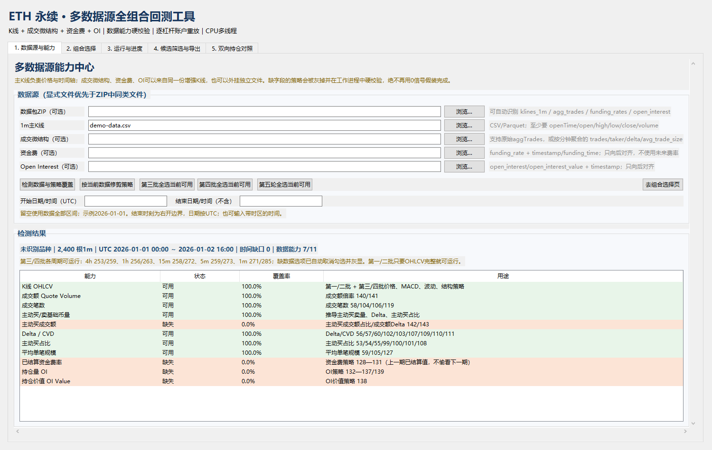
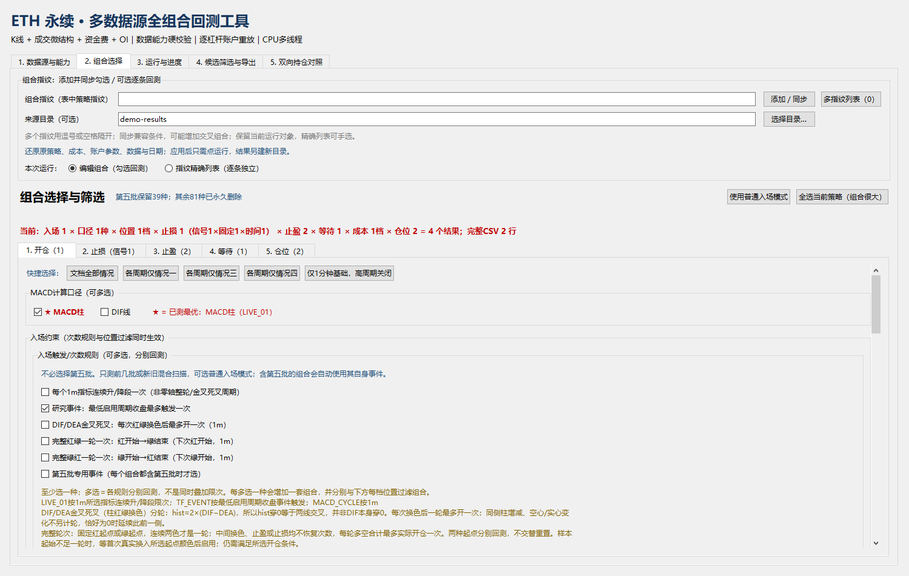
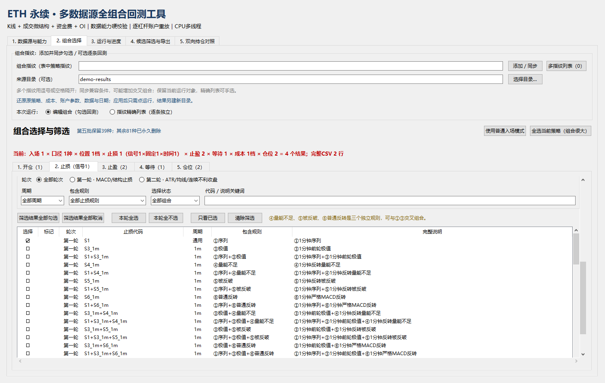
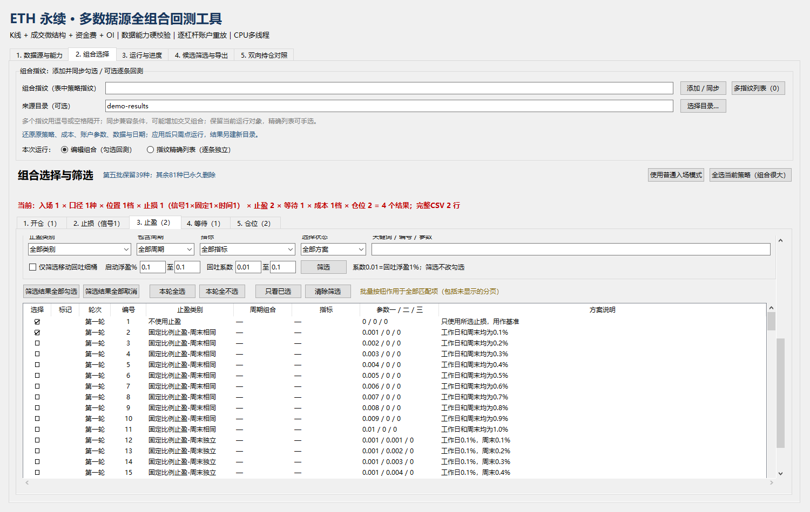
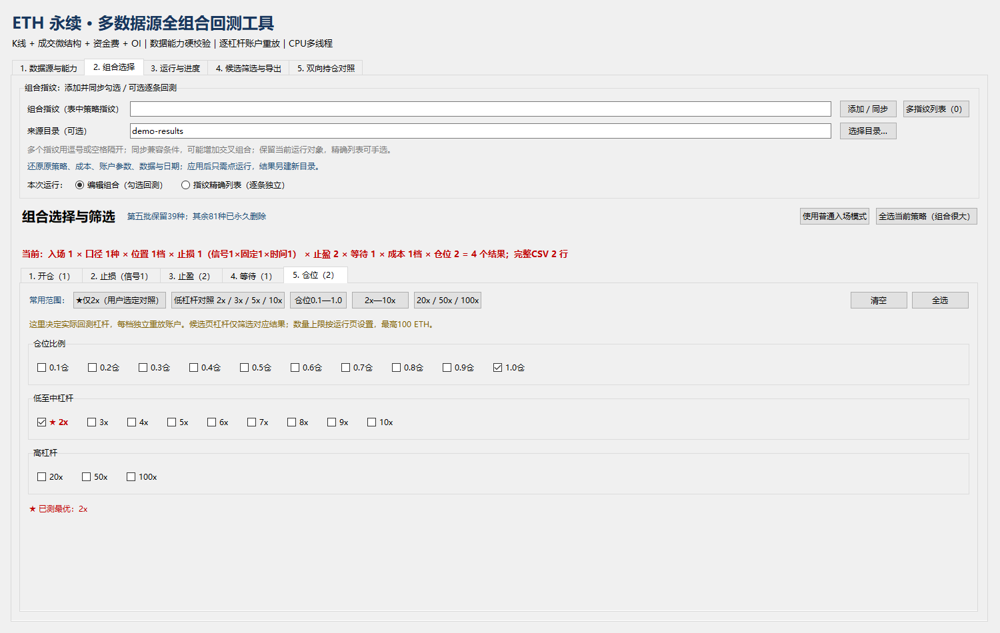
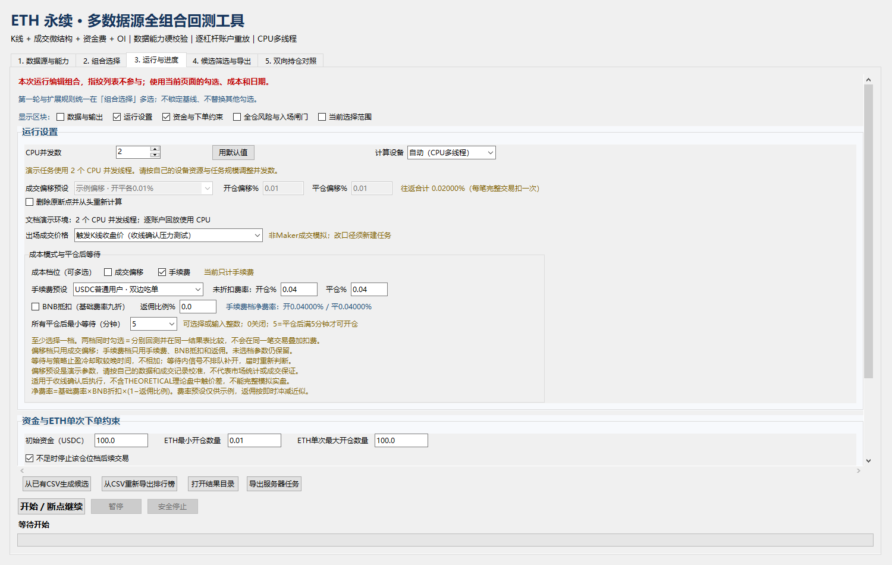
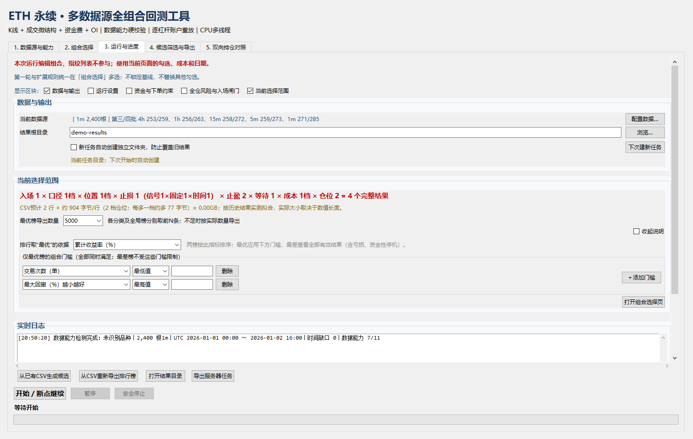
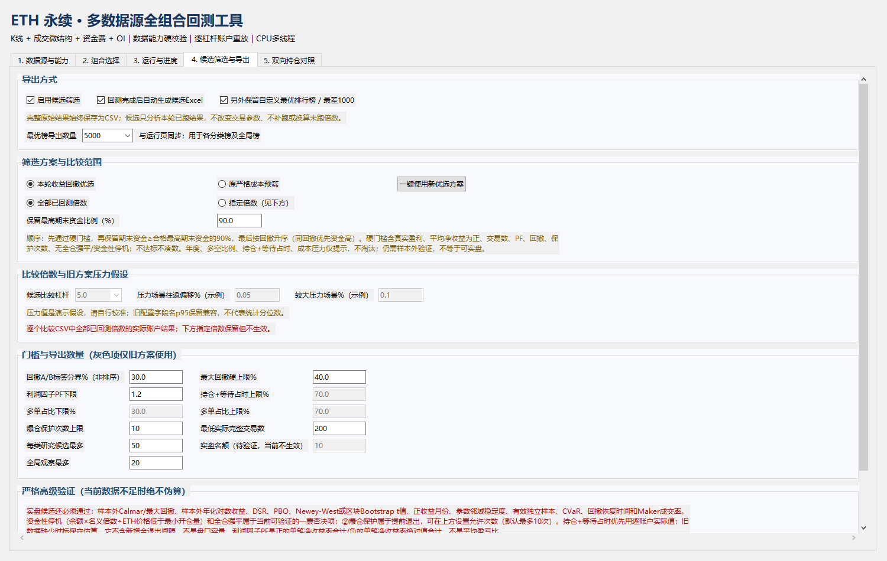
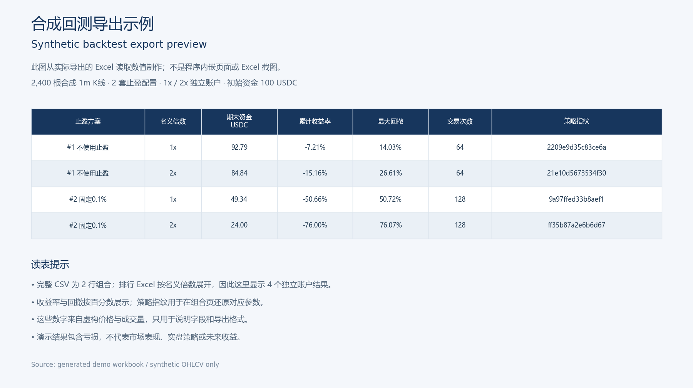

# 图解操作指南

[English](usage.en.md) | [返回项目介绍](../README.md)

这份指南对应公开 v1.72 副本的中文界面。以下八张操作图来自真实 Windows / Tkinter 窗口；数据是 **2,400 根合成 1 分钟 K 线**，演示比较 2 种止盈方案 × 1 倍 / 2 倍，共 4 个独立账户结果。它们用于说明操作与文件输出，不代表真实市场表现、实际交易或盈利能力。安装和授权说明见 [README](../README.md)。

整个流程是：**选数据并检测 → 选少量组合 → 核对成本与账户 → 运行 → 查看文件 → 另外生成榜单或候选**。先把这个小流程走通，再扩大组合范围。

图中的 `demo-data.csv` 和 `demo-results` 仅作示例，不随仓库提供；实际运行时选择自己准备的行情文件和新结果目录。

## 1. 数据源与能力：先检测，再选策略

进入「1. 数据源与能力」，在「1m主K线」旁点击「浏览…」选择文件。行情表必须满足 [数据格式](../README.md#数据格式) 要求，包括至少 500 根有效、连续的整分钟 K 线。按需要另外选择成交微结构、资金费、Open Interest，或者选择 ZIP；显式选择的文件优先于 ZIP 内同类文件。仅有 OHLCV 也可以开始基础规则研究。

点击「检测数据与策略覆盖」，核对品种、根数、UTC 时间范围、时间缺口，以及表中的「能力 / 状态 / 覆盖率 / 用途」。检测会自动取消并灰显缺字段的规则；「按当前数据修剪策略」也可按检测结果再次修剪当前选择。「第三批全选当前可用」等按钮会增加选择，并不代表全部规则都被验证有效。

资金费和 OI 数据只向后对齐，不把未来记录填到过去。辅助字段覆盖不完整时，某些周期的可用规则会更少；有一个字段名并不代表整段数据都有效。修改数据路径后重新检测。

「开始日期/时间（UTC）」包含起点，「结束日期/时间（不含）」排除终点；留空使用文件全部区间。选择范围必须仍有足够的连续数据。

## 2. 开仓：从单一规则开始

进入「2. 组合选择」→「1. 开仓条件」。第一次可用「仅1分钟基础，高周期关闭」缩小范围，然后核对实际勾选项：只选一种 MACD 口径、一种入场次数规则，保留一项开仓位置过滤，再选少量开仓条件。每个周期都必须有一项有效选择；高周期关闭时使用对应的关闭选项。

同周期多选默认分别回测；多个周期的选择会交叉生成组合。只有主动启用「指标组合」时，才枚举同周期两项或更多条件同时满足的组合。入场次数规则多选也是分别运行，不是把所有次数限制叠加到同一个账户。

页面顶部会实时显示组合规模。不要首次就点「全选当前策略（组合很大）」；这个按钮可能同时展开很多维度。带「已测最优」或星号的标注属于已有基准标记，不说明它在你的数据上最优。

第五批只能使用公开副本保留的 39 项，并按各方法原生周期与数据需求选择；没有其他 81 项的恢复开关。第五批独立产生多空与一次性事件，明确勾选的旧规则仍参与过滤；不能把普通 MACD 入场节奏套作所有第五批方法的定义。

## 3. 止损：筛选列表与实际勾选分开

在「2. 止损（含持仓时间）」选择信号止损、固定比例止损与持仓时间。列表可按轮次、类别、周期或关键词筛选；**筛选只改变显示范围，不会自动取消筛选之外已勾选的规则**。用「只看已选」核对当前选择，用「筛选结果全部取消」或逐项点击移除不需要的规则。

第一次保留一项信号止损方案即可。固定比例无需启用时用对应区域的「只保留OFF」；需要手填比例时，核对工作日 / 周末输入后点击「加入所选」。多个比例档分别生成组合。

时间止损到点按收盘价退出，不要求盈利；`0` 表示不启用。运行页还有账户保护与强平约束，它们和策略止损的作用不同，需要单独核对。

## 4. 止盈：确认方案与参数单位

进入「3. 止盈（含持仓时间）」，用类别、周期、指标、关键词或编号找到方案，点击列表中的勾选状态选择。图示勾选了 #1 / #2 两个方案作对照；第一次也可以只保留一个，再用「只看已选」确认。改变筛选条件不会清除其他已选方案。

「叠加固定比例止盈」与所选动态止盈并行，先触发的退出；无需叠加时点该区域「只保留OFF」。工作日 / 周末比例输入框按百分数解释，而列表的参数列随方案含义变化，不能都按百分数读。例如移动回吐筛选说明中的系数 `0.01` 是回吐浮盈的 1%。以本行方案说明为准。

时间止盈与时间止损不同：时间止盈需要到点且有浮盈。还要检查「4. 止盈后等待」：`0分钟（不等待）` 是基准选择；这项只作用于止盈退出，运行页的「所有平仓后最小等待」则作用于所有退出。

## 5. 仓位 / 杠杆：每档独立重放账户

进入「5. 仓位 / 杠杆」，可先点「清空」，再只选 `1.0仓` 和 `2x` 两档作小范围对照。每个止盈组合分别重放这两个账户，图示两种止盈合计 4 个账户结果。它们不共享余额，收益不能相加当成同账户组合收益。

名义倍数决定计划数量，但仍受运行页初始资金、ETH 最小数量和单次最大数量约束。名义倍数不意味着每笔都能开到该倍数，也不是盈利倍率。候选页的比较杠杆只筛选已计算的对应结果，不能补跑或换算未选过的仓位。

组合摘要分别显示账户结果数量和完整 CSV 行数。原始 CSV 的一个策略组合行可以含多档仓位的分号分隔序列，须结合「所选仓位顺序」解读；不能把 CSV 行数直接当作独立账户总数。

## 6. 成本与账户：百分数输入，不叠加两个成本场景

进入「3. 运行与进度」，在「成本模式与平仓后等待」至少勾选一档「成交偏移」或「手续费」。两档同时勾选会分别计算两种场景，不会在同一笔交易同时扣两类成本。未启用场景的输入可以留存，但不是本行实际成本。

| 位置 | 输入与解释 |
| --- | --- |
| 「开仓偏移%」「平仓偏移%」、手续费百分数框 | `0.01` 表示 **0.01%**；不要填 `0.0001` 代替 0.01% |
| 保存配置 / CLI JSON 的费率与偏移 | 小数比例 `0.0001` 表示 **0.01%** |
| 「返佣比例%」 | `10` 表示 10% 返佣；同时核对 BNB 抵扣与显示的净费率 |
| 候选页「压力场景往返偏移%（示例）」 | 往返压力假设，不是自动应用的开仓、平仓各一份费率 |

默认示例偏移为开、平各 0.01%；「USDC普通用户 · 双边吃单」源码预设手续费为开、平各 0.04%。这些是工具输入预设，不是交易所当前报价或你账户的实际成本。候选压力值 0.05% / 0.10% 也是演示假设，应自行校准。

核对出场成交价格口径、初始资金、ETH 数量上下限、保护退出、强平与 S3 闸门。固定资金费假设按 `%/8小时` 输入，它不是自动逐笔扣用历史资金费文件。还要区分「所有平仓后最小等待」与前一节的止盈专属等待。

## 7. 运行、暂停与安全停止

图中处于「等待开始」，因此「暂停」「安全停止」尚未启用。运行后才会在同页日志和进度区显示实际状态。

运行前核对「当前选择范围」、CSV 估算、CPU 并发和结果目录。保留「新任务自动创建独立文件夹，防止覆盖旧结果」，需要新任务时点「下次建新任务」。默认设备为 CPU；`自动` 也使用当前的 CPU 逐账户路径。

在编辑组合模式点击「开始 / 断点继续」，观察日志中的数据核验、特征 / 信号预计算、扫描和保存进度。首次 Numba 编译可能暂时没有完成行数增长；先看日志而不是反复启动。

「暂停」是请求，当前小任务结束后才进入暂停；按钮改为「继续」，点击后解除暂停。「安全停止」会保留已完成结果，普通单任务可在相同代码、环境、数据与参数下从最后完整止盈方案继续。不要在请求刚发出时强行结束进程；等日志和运行按钮恢复到停止状态再关闭窗口。

「删除原断点并从头重新计算」会删除该任务旧断点，不是普通继续按钮。代码或数据发生变化时，应新建任务。指纹精确列表模式会逐条独立回测，停止后不再启动后续条目；批量列表暂不支持断点续跑。

导出时「安全停止」停止相应 CSV 扫描，并不等同于可继续原回测。**本页没有回测结果排行榜表格**；完成后用「打开结果目录」查看输出文件。

## 8. 文件、榜单与候选：三个不同层次

| 输出 | 用来回答什么问题 |
| --- | --- |
| `全部回测结果.csv` | 本次实际完成的全部组合结果是什么？保留亏损及零交易记录，未完成任务的文件不是全计划完成证明 |
| 最优 / 最差排行榜 Excel | 按本次选择的排行指标，哪些账户结果处于前部或尾部？最优榜应用所设门槛；最差 1000 从全部排序数值有效的已完成账户结果取尾部，不受最优门槛过滤 |
| 分层候选 Excel / CSV | 哪些已跑结果通过候选方案与门槛，值得下一步研究？它不会改变交易参数或补跑未跑倍数 |

在「4. 候选筛选与导出」选择「本轮收益回撤优选」或「原严格成本预筛」。前者先按条件筛出合格账户，再保留达到合格最高期末资金比例的结果并按回撤排列；比例针对期末资金，不是净利润。选择全部已回测倍数或指定倍数，核对交易样本、回撤、PF、保护次数和导出数量。灰色字段可能只用于旧方案，并非当前方案会使用的门槛。

「启用候选筛选」和「回测完成后自动生成候选Excel」控制完成后的候选流程；也可以手动点击「从已有CSV生成候选」选择完整原始 CSV。「选择已有结果目录并生成候选」按钮同样会弹出 **CSV 文件选择框**。想修改榜单数量或指标，可用「从CSV重新导出排行榜」，不用重新跑交易。

用表格软件打开输出的 Excel。候选包含研究 / 观察层级；本版缺少严格高级验证所需的逐期证据，「实盘候选」始终为空。2,400 根短演示在默认最低 200 笔完整交易等门槛下没有候选，这是有效输出，不是导出失败。不要从榜单颜色或收益列推断它已完成样本外验证。

### 读一份真实演示导出

这是从演示的真实 Excel 文件读取内容后生成的阅读预览，**不是 Excel 截图，也不是程序内嵌排行榜**。图中展开 4 个账户行，原始 CSV 则为 2 个止盈组合行、各含两档仓位序列。交易数为 64 或 128，未达到默认 200 笔门槛；四个账户均亏损。因此存在「最优榜」导出也不意味着有盈利策略或研究候选。

读表时一起看止盈方案、名义倍数、完整交易数、期末资金、收益和回撤，再查看该行实际成本与指纹。原始配置记录决定结果的来源，颜色只辅助比较同一表中的数值。

## 指纹还原必须保留原来源

组合页顶部可填「组合指纹（表中策略指纹）」和「来源目录（可选）」，点击「添加／同步」。程序核验原结果目录中的排行 / 候选记录、运行配置、数据及日期后才应用，不是从指纹文字解码全部参数。

因此要一起保留 **原任务目录、配置 JSON、原始结果与对应数据**。只有指纹或 Excel 文件不够。多个兼容指纹同步到编辑器可能增加交叉组合；只想重跑原列表时，选择「指纹精确列表（逐条独立）」。应用配置后仍需手动开始，输出另建新目录。

## 常见问题

| 现象 | 检查方法 |
| --- | --- |
| 报错缺少 `tkinter` / `_tkinter` | 用同一 Python 环境执行 `python -m tkinter`，通过 Python 安装程序或发行版补装 Tk；Linux 还需要桌面或虚拟显示 |
| 中文显示方框或字体不全 | 在系统安装支持中文的字体后重新打开窗口；英文文档不会把当前 UI 切换成英文 |
| 没有策略可用或很多选项变灰 | 重新检测数据；核对字段、连续分钟、所选区间及各周期覆盖。先用仅需 OHLCV 的基础规则；不要把缺资金费 / OI / 逐笔的数据假装补齐 |
| 回测结束但没有候选 | 查看日志、完整 CSV 与候选筛选统计，核对是否有交易、是否通过门槛；研究候选可以为空，实盘候选本版固定为空 |
| 有 GPU 却仍使用 CPU | 当前逐账户回放需要 CPU；安装 CuPy 不会让该路径获得 GPU 加速 |
| 旧任务不能继续 | 版本、数据、Python / 数值依赖或冻结参数改变会触发身份拒绝。新建结果目录；不要删除身份记录绕过核验 |

Windows / Python 3.13.2 已本机验证；三平台自动测试状态见 [GitHub Actions](https://github.com/biaogebaofu/ui-backtest/actions)。macOS / Linux 尚未实机验证。无人值守四阶段研究的设置与命令见 [研究任务说明](research-campaign.md)。
